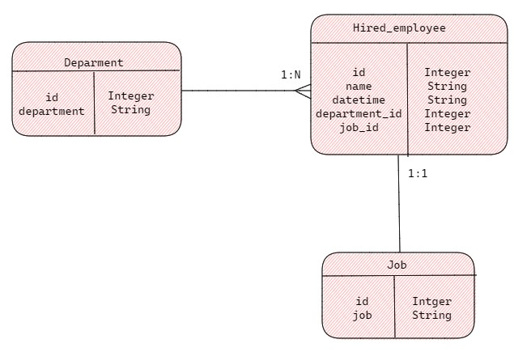

# TestGlobantDE
Repository created to store the code for the test in Globant apliccation as a Data Engineer

## Section 1
There was implemented the API with flask and python, we used SQL Alchemy for the connection and management with the database, that in this case is sqlite3(a future improvement could be implent another DBMS more robust like SQL Server or Postgress). We used the db.Model class in enhiretance with the models that we implement for the tables. 

We used the next Data Model:

We defined 3 routes for this section:
+ '/' is our index and it should be used to upload the csv to the data migration
+ '/upload' that give us the information of the file that was uploaded
+ '/insert_batch' to send the batch transactions to the hired employee table

## Section 2
This section was performed in Sqlite3, and the funtions that it give us, there were two methods and routes that provides the endpoint for querying the metrics, in this methods we dipose the data as a json.

We defined 2 routes for this section:
+ '/query_metric1' return the result of the first metric
+ '/query_metric2' return the result of the second metric

### First Metric
Number of employees hired for each job and department in 2021 divided by quarter. The
table must be ordered alphabetically by department and job.

### Second Metric
● List of ids, name and number of employees hired of each department that hired more
employees than the mean of employees hired in 2021 for all the departments, ordered
by the number of employees hired (descending).

### Docker Implementation
We have implement a Docker image, you need to initiate the docker engine with Docker Desktop 
and in the root folder initiate a terminal en run the command docker-compose up to run the app

### Test Implementation
We have implement a single test to the '/insert_batch' that checks if more than 1000 rows are traing to be inserted
As a future enhance of the API we should Implement more test: correct data insertion, correct format inserted, ... etc

### Cloud Hosting
A simple diagram of how we can implement the hosting of this API in the Cloud Service Microsoft Azure, we can host the API en 
App Service uploading the code from Azure DevOps or GitHub, implement teh Key Vault for the connection strings an access and store 
or tables and files in SQl Database or Blob Storage depending the case

### Future Upgrades
+ Enhance the folder and files structure of the project
+ Implement more test for the different methods
+ Implement the cloud hosting in Azure (prepare the code, configure the services...etc)